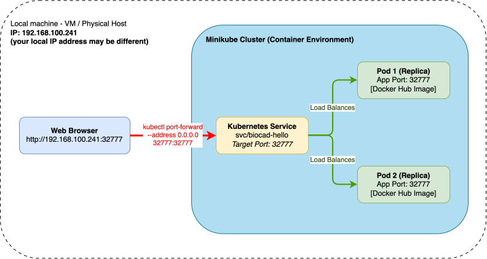
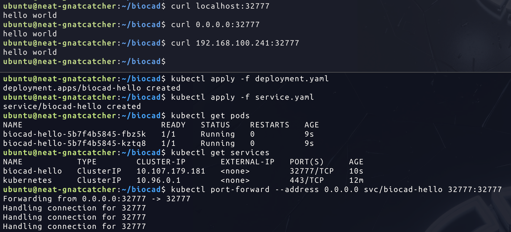

# Kubernetes Hello World Deployment on Minikube

[](https://go.dev/)
[](https://www.docker.com/)
[](https://kubernetes.io/)

Minimalist Go web server that responds with `hello world` — packaged as
a multi-architecture OCI image and deployed on Kubernetes with
production‑grade practices.

---

## Architecture



| Layer         | Technology                 | Details                                           |
|---------------|----------------------------|---------------------------------------------------|
| App           | **Go 1.27**                | Standard library only — zero external dependencies |
| Image         | **Multi-stage, multi-arch** | `golang:alpine` → `scratch`; `amd64` + `arm64`    |
| Orchestration | **Kubernetes**             | Deployment (2 replicas) + ClusterIP Service        |

---

## Quick Start

### 1. Run locally

```bash
cd biocad
go run main.go
```

In another terminal:

```bash
curl http://localhost:32777
# → hello world
```

### 2. Docker

```bash
# Build
docker build -t biocad-hello:1.0 .

# Run
docker run -p 32777:32777 biocad-hello:1.0

# Verify
curl http://localhost:32777
```

**Multi-architecture build & push**

```bash
docker buildx create --use --name multiarch
docker buildx build \
  --platform linux/amd64,linux/arm64 \
  -t <your-registry>/biocad-hello:1.0 \
  --push \
  .
```

Actual Docker image is hosted on Docker Hub [biocad-hello](https://hub.docker.com/repository/docker/georgysolovei/biocad-hello/general).
### 3. Minikube

```bash
# Start cluster
minikube start

# Deploy
kubectl apply -f deployment.yaml
kubectl apply -f service.yaml

# Port-forward and open in browser
kubectl port-forward --address 0.0.0.0 svc/biocad-hello 32777:32777
# Open http://localhost:32777 in your browser or http://<your IP addr>:32777
```

### Actual resulting screenshot



---

## API

| Method | Path | Response      | Status   |
|--------|------|---------------|----------|
| `GET`  | `/`  | `hello world` | `200 OK` |

All other paths also return `hello world` — the handler matches the root
and everything below it.

---

## Image Details

| Feature       | Implementation                                                                 |
| ------------- | ------------------------------------------------------------------------------ |
| **Build**     | Multi-stage `golang:1.27-alpine` → `scratch`                                   |
| **Binary**    | Static (`CGO_ENABLED=0`), stripped (`-ldflags="-s -w"`)                        |
| **Platforms** | `linux/amd64`, `linux/arm64` (via `--platform=$BUILDPLATFORM` + `$TARGETARCH`) |
| **Runtime**   | `scratch` — ~4 MB image, no shell, no package manager                          |
| **User**      | `65534:65534` (nobody — non-root)                                              |

---

## Kubernetes Resources

### Deployment (`deployment.yaml`)

| Parameter                  | Value                  | Rationale                               |
| -------------------------- | ---------------------- | --------------------------------------- |
| `replicas`                 | `2`                    | High availability                       |
| `podAntiAffinity`          | `preferred`            | Spreads pods across nodes when possible |
| `runAsUser` / `runAsGroup` | `65534`                | Non-root execution                      |
| `readOnlyRootFilesystem`   | `true`                 | Immutable filesystem                    |
| `capabilities.drop`        | `ALL`                  | Least privilege                         |
| `allowPrivilegeEscalation` | `false`                | Prevents privilege escalation           |
| `livenessProbe`            | `HTTP GET /` every 10s | Auto-restart on failure                 |
| `readinessProbe`           | `HTTP GET /` every 5s  | Removes pod from Service on failure     |
| `resources.requests`       | `10m CPU / 8Mi`        | Minimal guaranteed resources            |
| `resources.limits`         | `100m CPU / 16Mi`      | Hard cap                                |

### Service (`service.yaml`)

| Parameter             | Value               |
| --------------------- | ------------------- |
| `type`                | `ClusterIP`         |
| `port` / `targetPort` | `32777`             |
| `selector`            | `app: biocad-hello` |

---

## Health & Monitoring

| Endpoint | Use                                                              |
| -------- | ---------------------------------------------------------------- |
| `GET /`  | Liveness & readiness probe target — also serves the app response |

```bash
# Check from inside the cluster
kubectl run -it --rm debug --image=curlimages/curl -- sh
curl http://biocad-hello:32777
```

---

## Security

- ✅ Non-root container (`USER 65534`)
- ✅ Read-only root filesystem
- ✅ All Linux capabilities dropped
- ✅ No shell or package manager in runtime image (`FROM scratch`)
- ✅ Static binary — no dynamic linking, minimal attack surface
- ✅ Pod-level security context enforced in deployment

---

## License

MIT
